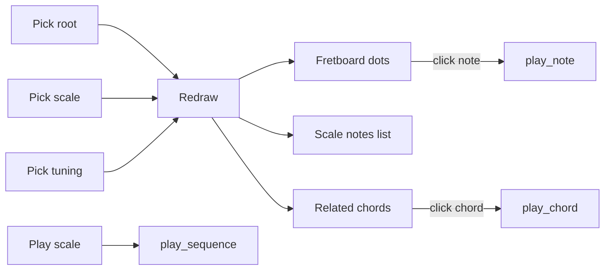
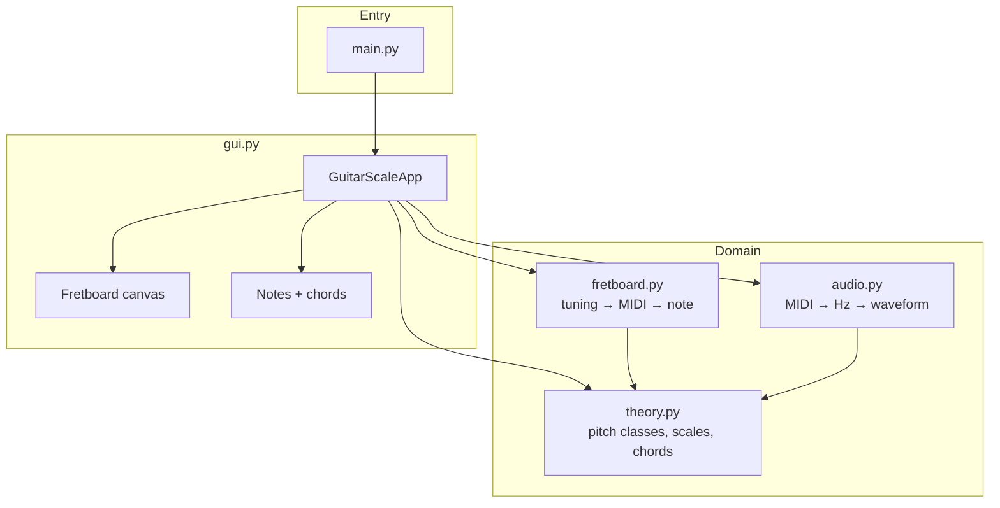
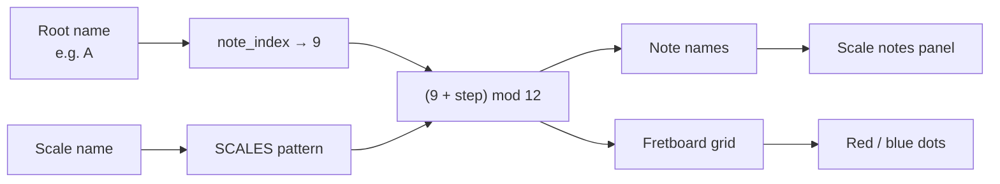
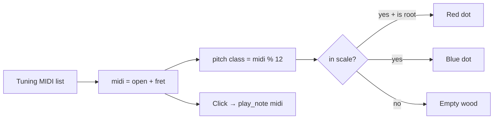
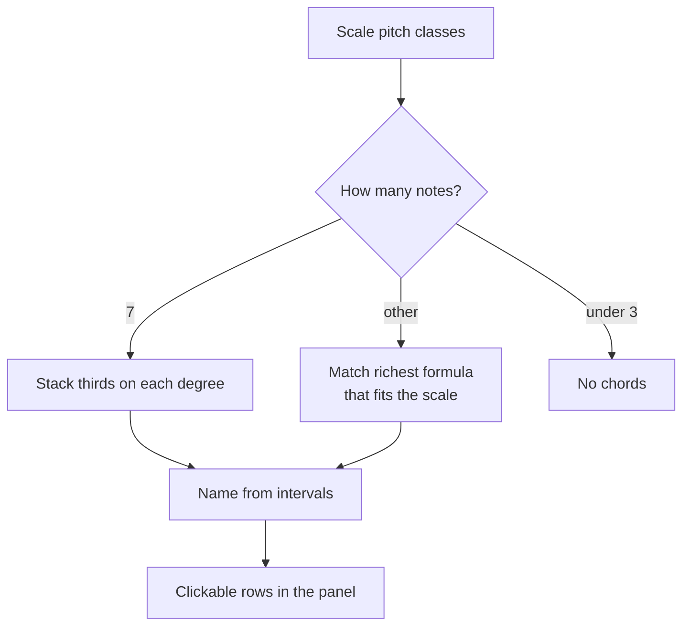
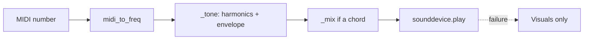

# ai_scaler — written guide

A Python desktop app that maps any scale onto a guitar neck, lists the notes,
harmonizes related chords, and plays synthesized tones. This document explains
how to use it and how the code is put together.

**Play scale** uses black, regular-weight text on the same blue as the button
fill (`#3d7fd6`). Red dots are the root. Blue dots are every other scale tone.

---

## 1. Run the app

```bash
source .venv/bin/activate   # or: python3 -m venv .venv && source .venv/bin/activate
pip install -r requirements.txt
python main.py
```

Needs Python 3.9+, Tkinter, `numpy`, and `sounddevice`. If audio cannot start,
the window still works; the status bar explains why.

`main.py` only adds `src/` to `sys.path` and starts the GUI:

```python
sys.path.insert(0, os.path.join(os.path.dirname(os.path.abspath(__file__)), "src"))
from ai_scaler.gui import run

if __name__ == "__main__":
    run()
```

---

## 2. Window layout

```
┌──────────────────────────────────────────────────────────────────────────┐
│ Root [C ▼]  Scale [Major (Ionian) ▼]  Tuning [Standard ▼]  [Play scale]  │
├────────────────────────────────────────────────────────────┬─────────────┤
│  open  1  2  3  4  5  6  7  8  9  10 11 12 13 14 15        │ Scale notes │
│  E  ●──────────●────●────●──────────●────●────●            │ [C] D E F   │
│  B  ────●────●──────────●────●────●──────────●             │ G A B       │
│  G  ●────●──────────●────●────●──────────●────●            │             │
│  D  ────●────●────●──────────●────●────●                   │ Related     │
│  A  ●────●────●──────────●────●────●                       │ chords      │
│  E  ●──────────●────●────●──────────●────●                 │ Cmaj7 C E G B│
│      red = root     blue = scale tone                      │ Dm7  D F A C│
├────────────────────────────────────────────────────────────┴─────────────┤
│ Ready. Click a note or chord to play.                                    │
└──────────────────────────────────────────────────────────────────────────┘
```

| Control | What it does |
|---|---|
| **Root** | Tonic. Every matching pitch is drawn red. |
| **Scale** | Interval pattern (major, modes, pentatonic, blues, exotic). |
| **Tuning** | Open-string pitches. Relabels the nut and remaps every dot. |
| **Play scale** | Plays the scale from the root up to the octave. |
| **Fretboard** | Click a lit note to hear that pitch. |
| **Related chords** | Click a row to hear a voicing. |

High E is at the **top** of the canvas, low E at the **bottom**. Open strings
sit left of the nut.



---

## 3. Architecture

Four modules, one job each. The GUI never computes intervals or frequencies
itself; it asks `theory`, `fretboard`, and `audio`.



| File | Responsibility |
|---|---|
| `src/ai_scaler/theory.py` | Notes, scale intervals, chord harmonization |
| `src/ai_scaler/fretboard.py` | Tunings and string/fret → note + MIDI |
| `src/ai_scaler/audio.py` | Tone synthesis and playback |
| `src/ai_scaler/gui.py` | Window, drawing, click handling |

---

## 4. How a scale becomes dots

Pitch classes are integers `0–11` with `0 == C`. A scale is a list of
**semitone offsets from the root**, always starting at `0`.

```python
NOTES = ["C", "C#", "D", "D#", "E", "F", "F#", "G", "G#", "A", "A#", "B"]

SCALES = {
    "Major (Ionian)":          [0, 2, 4, 5, 7, 9, 11],
    "Natural Minor (Aeolian)": [0, 2, 3, 5, 7, 8, 10],
    "Harmonic Minor":          [0, 2, 3, 5, 7, 8, 11],
    "Dorian":                  [0, 2, 3, 5, 7, 9, 10],
    "Mixolydian":              [0, 2, 4, 5, 7, 9, 10],
    "Minor Pentatonic":        [0, 3, 5, 7, 10],
    "Blues":                   [0, 3, 5, 6, 7, 10],
    "Phrygian Dominant":       [0, 1, 4, 5, 7, 8, 10],
    "Japanese Hirajoshi":      [0, 2, 3, 7, 8],
}
```

Adding the root and wrapping modulo 12 produces the sounding notes:

```python
def scale_pitch_classes(root: str, scale_name: str) -> list[int]:
    root_pc = note_index(root)
    return [(root_pc + step) % 12 for step in SCALES[scale_name]]

def scale_notes(root: str, scale_name: str) -> list[str]:
    return [note_name(pc) for pc in scale_pitch_classes(root, scale_name)]
```

**Example — C major**

```
root C = 0
steps     0  2  4  5  7  9  11
notes     C  D  E  F  G  A   B
```

**Example — A Dorian vs A natural minor**

```
A natural minor  A  B  C  D  E  F   G
A Dorian         A  B  C  D  E  F#  G
                          one raised sixth
```



---

## 5. Fretboard model

Each tuning is a list of **open-string MIDI numbers**, low string → high string.
Standard guitar is E2 A2 D3 G3 B3 E4:

```python
TUNINGS = {
    "Standard (E A D G B E)":              [40, 45, 50, 55, 59, 64],
    "Drop D (D A D G B E)":                [38, 45, 50, 55, 59, 64],
    "Half Step Down (Eb Ab Db Gb Bb Eb)":  [39, 44, 49, 54, 58, 63],
    "Open G (D G D G B D)":                [38, 43, 50, 55, 59, 62],
    "DADGAD":                              [38, 45, 50, 55, 57, 62],
}
```

A fret is just `open MIDI + fret index`. The pitch class is `midi % 12`:

```python
def midi_at(self, string_index: int, fret: int) -> int:
    return self.open_midi[string_index] + fret

def scale_positions(self, root: str, scale_name: str):
    scale_pcs = set(theory.scale_pitch_classes(root, scale_name))
    root_pc = theory.note_index(root)
    # for every string and fret 0..15:
    #   in_scale = (midi % 12) in scale_pcs
    #   is_root  = (midi % 12) == root_pc
```

Drop D only changes MIDI `40 → 38` on string 0. Every D on that string,
including the open string, becomes a red root if the selected root is D.



---

## 6. Related chords

Seven-note scales are harmonized the classical way: stack scale thirds on each
degree (root, third, fifth, seventh).

```python
# For each degree i of a 7-note scale:
member_pcs = [pcs[(i + step) % n] for step in (0, 2, 4, 6)]
```

**C major sevenths**

```
degree  1      2      3      4      5      6      7
chord   Cmaj7  Dm7    Em7    Fmaj7  G7     Am7    Bm7b5
notes   C E G B
        D F A C
        E G B D
        …
```

Intervals from the chord root decide the quality suffix:

```python
_SEVENTH_QUALITY = {
    ("", 11): "maj7",     # major triad + major 7th
    ("", 10): "7",        # major triad + minor 7th
    ("m", 10): "m7",
    ("dim", 10): "m7b5",  # half-diminished
}
```

Pentatonics, blues, and symmetric scales do **not** stack into neat sevenths.
For those, the app walks a list of standard formulas (richest first) and keeps
the first whose notes all sit inside the scale:

```python
def related_chords(root, scale_name, sevenths=True):
    pcs = scale_pitch_classes(root, scale_name)
    if len(pcs) == 7:
        return _harmonize_by_thirds(pcs, sevenths)
    return _match_chords(pcs)
```



---

## 7. Sound

Equal temperament, A4 = 440 Hz, MIDI 69 = A4:

```python
def midi_to_freq(midi: int) -> float:
    return 440.0 * (2.0 ** ((midi - 69) / 12.0))
```

A note is a sine plus two harmonics, times a fast-attack / decaying envelope
(a cheap plucked-string):

```python
wave = (
    1.00 * sin(2π f t) +
    0.35 * sin(2π · 2f t) +
    0.15 * sin(2π · 3f t)
)
env  = attack(5 ms) * (linear decay) ** 1.6
```



**Play scale** builds MIDI from the same interval list, then appends the octave:

```python
def play_scale(self) -> None:
    root_midi = 48 + theory.note_index(self.root_var.get())  # C3–B3
    midis = [root_midi + step for step in theory.SCALES[self.scale_var.get()]]
    midis.append(root_midi + 12)
    audio.play_sequence(midis)
```

Chords are voiced upward from C3 so each next note is higher than the last
(`_voice_chord` in `gui.py`). Playback is non-blocking (a daemon thread). If
`sounddevice` cannot open a device, `audio.available()` is false and the status
bar says so.

---

## 8. Drawing and clicks

Only in-scale positions become dots. Color is the whole point of the neck:

```python
fill = ROOT_COLOR if pos.is_root else SCALE_COLOR   # #e8543f vs #3d7fd6
```

Each drawn oval is registered as `(x, y, radius, midi)`. A click hits the first
dot whose circle contains the pointer:

```python
def _on_canvas_click(self, event) -> None:
    for x, y, r, midi in self._dots:
        if (event.x - x) ** 2 + (event.y - y) ** 2 <= r * r:
            audio.play_note(midi)
            return
```

The canvas is redrawn on every root / scale / tuning change and on resize.

---

## 9. Color and UI tokens

| Token | Hex | Used for |
|---|---|---|
| `ROOT_COLOR` | `#e8543f` | Root dots |
| `SCALE_COLOR` | `#3d7fd6` | Scale dots, Play scale fill, notes text |
| Play scale **text** | `#000000` | Regular Helvetica 11, not bold |
| `CHORD_BG` / `CHORD_FG` | `#ffffff` / `#000000` | Chord rows |
| `BG` / `PANEL_BG` | `#1e2230` / `#262b3d` | Window chrome |

Play scale is a `ttk.Button` on the `clam` theme so macOS honors the black
label and a border that matches the fill:

```python
style.configure(
    "Play.TButton",
    background=SCALE_COLOR,
    foreground="black",
    font=("Helvetica", 11),
    bordercolor=SCALE_COLOR,
    lightcolor=SCALE_COLOR,
    darkcolor=SCALE_COLOR,
    relief="flat",
)
```

---

## 10. A short practice loop

1. Set **Root** to the key of a song you already play.
2. Set **Scale** to what the melody actually uses (minor pentatonic, Mixolydian,
   Dorian, harmonic minor, …).
3. Find every red root, then connect nearby blue notes.
4. Click related chords and strum those shapes on the guitar.
5. Change one thing tomorrow: a mode, an exotic scale, or a tuning.

---

## 11. Scale catalog

**Common:** Major (Ionian), natural / harmonic / melodic minor, Dorian,
Phrygian, Lydian, Mixolydian, Locrian, major and minor pentatonic, blues.

**Exotic:** whole tone, diminished (half-whole and whole-half), Phrygian
dominant, Hungarian minor, double harmonic (Byzantine), Neapolitan major and
minor, enigmatic, Hirajoshi, In Sen, Prometheus, augmented.

You do not need the history. Pick a name; the neck shows where to put your
fingers.
